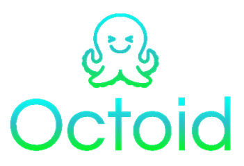

# Octoid

<p align="center"></p>


## Intro 

Octoid is a tool for translating Objective-C headers into Delphi code. It is intended as a replacement for SDKTransform which ships with Delphi.
(Octoid is an acronym for Objective-C TranslatOr Into Delphi)


<p align="center" style="margin: 50px 0 0 0;">


</p> 

## License

Please refer to the [license](https://github.com/Embarcadero/octoid/blob/main/LICENSE) regarding conditions of use for the code of Octoid.


## Technical details

If you are interested in the details about how the Octoid code works, please refer to the [technical details readme](https://github.com/Embarcadero/octoid/blob/main/TechDetails.md).

## Dependencies

Octoid depends on Erik Van Bilsen's libraries:

[Chet](https://github.com/neslib/Chet)
[Neslib.Clang](https://github.com/neslib/Neslib.Clang)

Which Erik has granted permission to use in Octoid, and are presently included in the Octoid source

Neslib.Clang is dependent on 64-bit CLang binaries that ship with [LLVM](https://llvm.org/)

In order to run Octoid, you will need to download and install LLVM. At time of writing, Octoid works with version 10.0.0 (there was no installer for Windows 64-bit for version 10.0.1).

**Please ensure that you select the "Add LLVM to the system path for all users" option when installing**

[This is a direct link to the version 10.0.0 installer](https://github.com/llvm/llvm-project/releases/download/llvmorg-10.0.0/LLVM-10.0.0-win64.exe)

[This is a link to the releases page](https://releases.llvm.org/) which lists all releases

<p align="center">


</p> 

## Desktop App

The desktop app is a GUI (VCL) application for Windows. It allows you to select an SDK, select a framework and transform it into a Delphi unit.

The options page allows you customize how a banner (if required) is inserted into the unit.

<p align="center" style="margin: 25px 0 25px 0;"></p>

<p align="center">


</p> 

## Commandline App

The commandline app is provided for automated transforms, or if you just prefer the command line. The usage is as follows:

```
Octoid [Options] [Extras]

Options:

--help or --?  - show this help

--sdkroot <sdkroot> - root of the target SDK

--clanginclude <clanginclude> - path to the Clang include files. May be omitted if a supported version of Clang is installed

--platform <platform> - the target platform (macOS or iOS)

--unit <framework> - (optional) transform only the framework with the specified name (default is all frameworks in the SDK)

--out <out> - (optional) directory where the output .pas files should be placed (default is current directory)

--typemap <typemap> - (optional) map of types containing equals separated values (can override existing mappings)

--typeunitmap <typeunitmap> - (optional) map of types to units containing equals separated values (can override existing mappings)

Extras: additional options to be passed to libClang
```
<p align="center">


</p> 

## Transforming 3rd party frameworks 

It is possible to transform 3rd party frameworks, by copying the `.framework` folder into the `System\Library\Frameworks` folder of the nominated platform SDK.
It should be noted however, if the framework depends on any other 3rd party frameworks (including from the same vendor), they will need to be copied also, in order for a successful transform. Once a 3rd party framework has been copied, when the desktop app is restarted, or when a switch is made between SDKs, it will include the 3rd party framework in the frameworks list

<p align="center">


</p> 

## Dealing with fatal errors during translation

If a conversion fails to produce a translation using the desktop app, the output window will show and be at the bottom of the output so as to highlight the errors.

Commonly, this will be due to missing header files, e.g. you may see an output like:

```
FATAL errors:
C:\Users\dave\Documents\Embarcadero\Studio\SDKs\MacOSX14.2.sdk\System\Library\Frameworks/CoreVideo.framework/Headers/CVDisplayLink.h:26:10: error: 'OpenGL/OpenGL.h' file not found
C:\Users\dave\Documents\Embarcadero\Studio\SDKs\MacOSX14.2.sdk\System\Library\Frameworks/CoreVideo.framework/Headers/CVOpenGLBuffer.h:20:10: error: 'OpenGL/OpenGL.h' file not found
C:\Users\dave\Documents\Embarcadero\Studio\SDKs\MacOSX14.2.sdk\System\Library\Frameworks/CoreVideo.framework/Headers/CVOpenGLBuffer.h:21:10: error: 'OpenGL/gltypes.h' file not found
C:\Users\dave\Documents\Embarcadero\Studio\SDKs\MacOSX14.2.sdk\System\Library\Frameworks/CoreVideo.framework/Headers/CVOpenGLTexture.h:22:10: error: 'OpenGL/OpenGL.h' file not found
C:\Users\dave\Documents\Embarcadero\Studio\SDKs\MacOSX14.2.sdk\System\Library\Frameworks/CoreVideo.framework/Headers/CVOpenGLTexture.h:23:10: error: 'OpenGL/gltypes.h' file not found
C:\Users\dave\Documents\Embarcadero\Studio\SDKs\MacOSX14.2.sdk\System\Library\Frameworks/CoreVideo.framework/Headers/CVOpenGLTextureCache.h:16:10: error: 'OpenGL/OpenGL.h' file not found
C:\Users\dave\Documents\Embarcadero\Studio\SDKs\MacOSX14.2.sdk\System\Library\Frameworks/AppKit.framework/Headers/NSImageView.h:12:9: error: 'Symbols/NSSymbolEffect.h' file not found
C:\Users\dave\Documents\Embarcadero\Studio\SDKs\MacOSX14.2.sdk\System\Library\Frameworks/AppKit.framework/Headers/NSOpenGL.h:10:9: error: 'OpenGL/CGLTypes.h' file not found
C:\Users\dave\Documents\Embarcadero\Studio\SDKs\MacOSX14.2.sdk\System\Library\Frameworks/AppKit.framework/Headers/NSOpenGL.h:11:9: error: 'OpenGL/gltypes.h' file not found

The following appear to be frameworks not imported into the SDK, or are dependent frameworks that are missing:
OpenGL, Symbols
```

Octoid makes "intelligent guesses" about the errors, and in this case has identified frameworks that appear to have not been imported into the target SDK (in this case macOS 14.2)

[This link contains some instructions](https://github.com/DelphiWorlds/HowTo/tree/main/Solutions/AddSDKFrameworks) about how to add missing frameworks.

<p align="center">


</p> 

## Fixing issues with a translation

Octoid is yet to produce "perfect" translations 100% of the time. The following are tips for resolving issues you might encounter.

### References missing from existing imports

As at Jan 1st, 2024, there are some existing imports that are yet to be updated, so even though Octoid may include the relevant unit in the interface uses clause, there may be references that are missing from that unit, e.g.:

`NSErrorDomain`:

This type is expected to be in the `Foundation` import for the respective OS e.g. `iOSapi.Foundation`. 

`NSErrorDomain` is just a synonym for `NSString`, so one way to fix this is to simply insert a declaration for it **in the unit that Octoid created for you**, i.e. put this in the type declarations:

```delphi
  NSErrorDomain = NSString;
```

Other missing references may not be as straightforward, e.g. if you use Octoid to import the `WebKit` framework for iOS, the compiler will report an error here:

```delphi
    function findInteraction: UIFindInteraction; cdecl;
```

`UIFindInteraction` is part of the `UIKit` framework, however it is yet to be included in `iOSapi.UIKit.pas`. You could solve this by:

Doing an import of `UIKit`, and extracting the declarations for `UIFindInteraction` and any other types it depends on, 

**OR** 

If the `findInteraction` method is not required by your code, you could just comment out the line, perhaps adding a comment indicating why the function was commented out. 

### Unit not included in the interface uses clause

If you use Octoid to import the `CoreHaptics` framework for iOS, you will notice an error in the declaration for `CHHapticEngine`:

```delphi
    function initWithAudioSession(audioSession: AVAudioSession; error: PPointer): Pointer; cdecl;
```

The compiler reports:

```
[DCC Error] iOSapi.CoreHaptics.pas(219): E2003 Undeclared identifier: 'AVAudioSession'
```

The `AVAudioSession` type is declared in the unit `iOSapi.AVFoundation`, so it is a simple matter of adding it to the interface uses clause of the unit that Octoid created, i.e. `iOSapi.CoreHaptics`

<p align="center">


</p> 